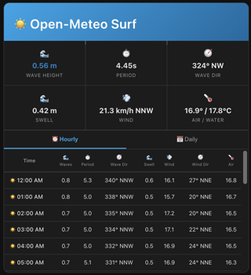

# Open-Meteo Surf Dashboard Templates

## Custom Surf Forecast Card (Recommended)

The integration includes a custom Lovelace card that displays current conditions and hourly/daily forecasts in a surf-optimized layout.

## Example



### Basic usage

```yaml
type: custom:openmeteo-surf-card
entity: weather.open_meteo_surf
```

### Full configuration

```yaml
type: custom:openmeteo-surf-card
entity: weather.open_meteo_surf
title: "My Surf Spot"
display_mode: normal           # "compact" | "normal" | "elaborated"
forecast_type: both            # "hourly" | "daily" | "both"
show_params:
  - wave_height
  - wave_period
  - wave_direction
  - swell_wave_height
  - wind_speed
  - wind_direction
  - temperature
  - precipitation
  - sea_surface_temperature
# Optional appearance overrides (leave empty to use theme)
primary_color: ""              # e.g. "#0ea5e9" or empty for theme
border_radius: ""              # e.g. "12px" or 16
tooltip_style: theme           # "theme" | "dark"
show_header: true
show_header_logo: true
show_watermark: true
# Content visibility
show_current_conditions: true
show_forecast_table: true
show_tabs: true
forecast_rows_hourly: 24       # optional, default 24 (12 in compact)
forecast_rows_daily: 7         # optional, default 7 (5 in compact)
# Refresh
show_refresh_button: true
show_refresh_text: true
```

### Configuration options

| Option | Required | Default | Description |
|--------|----------|---------|-------------|
| `entity` | ✅ | – | Weather entity ID (e.g. `weather.pipeline`) |
| `title` | ❌ | Entity name | Card title override |
| `display_mode` | ❌ | `normal` | `compact` (smaller, fewer stats), `normal`, or `elaborated` (larger, more spacing) |
| `forecast_type` | ❌ | `both` | `hourly`, `daily`, or `both` |
| `show_params` | ❌ | (all main params) | Which parameters to show in forecast table |
| `primary_color` | ❌ | (theme) | Override primary color (hex, e.g. `#0ea5e9`). Empty = use theme |
| `border_radius` | ❌ | (theme) | Card border radius (e.g. `12px` or `16`). Empty = use theme |
| `tooltip_style` | ❌ | `theme` | `theme` (match dashboard) or `dark` |
| `show_header` | ❌ | `true` | Show/hide card header |
| `show_header_logo` | ❌ | `true` | Show/hide logo in header |
| `show_watermark` | ❌ | `true` | Show/hide faint icon watermark in content |
| `show_current_conditions` | ❌ | `true` | Show/hide current stats grid |
| `show_forecast_table` | ❌ | `true` | Show/hide forecast table |
| `show_tabs` | ❌ | `true` | When `forecast_type: both`, show hourly/daily tabs |
| `forecast_rows_hourly` | ❌ | 24 (12 compact) | Max hourly forecast rows |
| `forecast_rows_daily` | ❌ | 7 (5 compact) | Max daily forecast rows |
| `show_refresh_button` | ❌ | `true` | Show refresh button |
| `show_refresh_text` | ❌ | `true` | Show "Refresh" text on button |

### Theme matching

The card uses Home Assistant theme variables (`--primary-color`, `--primary-text-color`, etc.) so it matches your applied theme. Override with `primary_color` or `border_radius` if needed.

### Available parameters

| Key | Description |
|-----|-------------|
| `wave_height` | Wave height (m) |
| `wave_period` | Wave period (s) |
| `wave_direction` | Wave direction (°) |
| `swell_wave_height` | Swell wave height (m) |
| `swell_wave_period` | Swell period (s) |
| `swell_wave_direction` | Swell direction (°) |
| `sea_surface_temperature` | Water temperature (°C) |
| `temperature` | Air temperature (°C) |
| `wind_speed` | Wind speed (km/h) |
| `wind_direction` | Wind direction (°) |
| `precipitation` | Precipitation (mm) |

### Card setup

The card resource is auto-registered when the integration loads. If it doesn't appear, manually add this resource:

**Settings → Dashboards → Resources → Add Resource:**
- URL: `/openmeteo_surf/openmeteo-surf-card.js`
- Type: JavaScript Module

---

## Sensor-based Dashboard (Alternative)

This YAML uses the individual sensor entities for a simpler view without forecasts.
**Note:** Replace `open_meteo_surf` with your actual surf spot's entity name.

```yaml
type: vertical-stack
cards:
  - type: entity
    entity: sensor.open_meteo_surf_wave_height
    name: "🌊 Current Wave Height"
    icon: mdi:water
    attribute: unit_of_measurement

  - type: horizontal-stack
    cards:
      - type: gauge
        entity: sensor.open_meteo_surf_wave_height
        min: 0
        max: 5
        needle: true
        severity:
          green: 0
          yellow: 1.5
          red: 3
        name: "🌊 Waves (m)"
      - type: gauge
        entity: sensor.open_meteo_surf_wind_speed
        min: 0
        max: 50
        needle: true
        name: "🌬️ Wind (km/h)"

  - type: glance
    show_name: true
    show_icon: true
    show_state: true
    entities:
      - entity: sensor.open_meteo_surf_wave_period
        name: "⏱️ Period"
        icon: mdi:timer-outline
      - entity: sensor.open_meteo_surf_wave_direction
        name: "🧭 Direction"
        icon: mdi:compass-outline
      - entity: sensor.open_meteo_surf_swell_height
        name: "🌊 Swell"
        icon: mdi:waves

  - type: entities
    title: "🌊 Detailed Marine Conditions"
    show_header_toggle: false
    entities:
      - entity: sensor.open_meteo_surf_swell_period
        name: "⏱️ Swell Period"
      - entity: sensor.open_meteo_surf_swell_direction
        name: "🧭 Swell Direction"
      - entity: sensor.open_meteo_surf_sea_surface_temperature
        name: "🌡️ Water Temp"
      - entity: sensor.open_meteo_surf_sea_level
        name: "📏 Sea Level (Tide)"

  - type: entities
    title: "🌦️ Local Weather"
    show_header_toggle: false
    entities:
      - entity: sensor.open_meteo_surf_air_temperature
        name: "🌡️ Air Temp"
      - entity: sensor.open_meteo_surf_wind_gusts
        name: "🌪️ Wind Gusts"
      - entity: sensor.open_meteo_surf_precipitation
        name: "🌧️ Precipitation"

  - type: button
    name: "🔄 Refresh Data Now"
    icon: mdi:refresh
    action_name: Refresh
    tap_action:
      action: call-service
      service: button.press
      target:
        entity_id: button.open_meteo_surf_refresh
```
